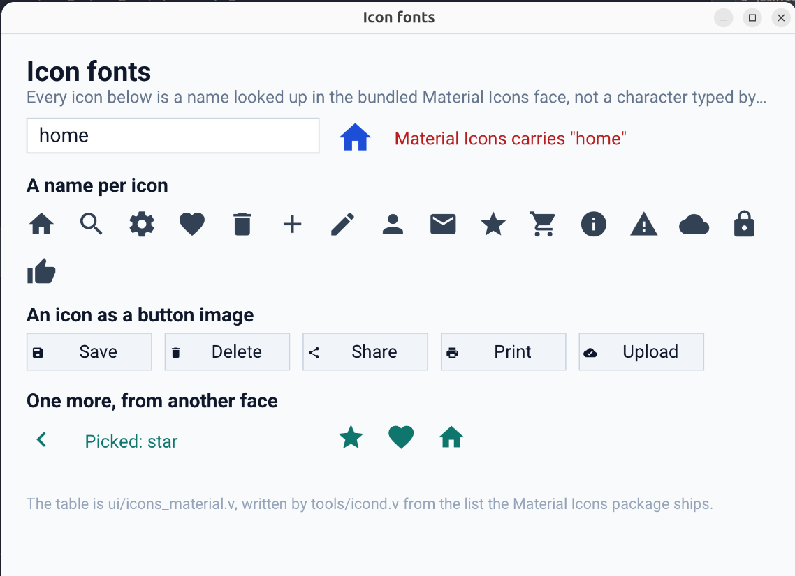

# Icon fonts

An icon is a label drawing one private use code point in a font whose names are
looked up. `ui2` gives that a name, a table, and a set of calls that make it read
the way any other control does:

```v
import ui2

ui2.icon_label('home_icon', 'material', 'home', rect, style)
ui2.icon_button('save', 'material', 'save', 'Save', rect, box, style)
ui2.icon_name('material', 'home')   // the single character
```

In VML, a `Label` or a `Button` carries `icon`:

```
Button { id: save icon: save text: "Save" on_tap: save_it }
Label  { id: badge icon: favorite }
```

`icon` is the *name*, not a character. Nothing in a document, and nothing in a
program, ever contains a private use code point written by hand: those code
points mean nothing outside the font, so a name is the only thing worth carrying
around.

A `Label` with an `icon` draws that one glyph, and a `text` beside it is not
used. A label holds one string, and for an icon label the string is the glyph:
a name drawn in an icon font would come out as one empty box per letter, because
an icon font carries no letters. A name meant for a screen reader wants an
accessibility field, and an element has none to put it in.



## What ships

The Material Icons face in `assets/fonts/MaterialIcons-Regular.ttf` and its
2234 names in `ui/icons_material.v`. The two are used together and are not
useful apart: the table says which code point to draw, the file says what it
looks like.

The bundled face answers to the alias `material` from the first call, with
nothing to register:

```v
ui2.icon_label('home_icon', 'material', 'home', rect, style)
```

That is deliberate. A font shipped beside a binary is not installed on the
machine running it, so a face that had to be registered before use would be a
face an example could not demonstrate.

## Bringing your own font

```v
font := ui2.register_icon_font('fa', '/path/to/fontawesome.ttf')!
glyph := ui2.icon_name('fa', 'comment')
```

The family is read out of the file itself, so nothing has to be told twice, and
the name table comes from one of three places, in this order:

1. a table `ui2` ships for that family;
2. a table you pass to `register_icon_font_with_map`;
3. nothing — the font still draws if the machine has it installed, it just has
   no names to answer to.

For a family `ui2` ships no table for, `register_builtin_icon_font` adds one
without a file:

```v
ui2.register_builtin_icon_font('bi', 'bootstrap-icons', table)
```

`ui2` ships no Font Awesome, no Bootstrap Icons and no other third-party face.
Their licences differ (MIT, OFL, CC BY 4.0) and bundling them would make the
`ui2` licence depend on which icon set an application happened to pick.
Material Icons is Apache 2.0 and already shipped here.

## Reading names out of a package

`tools/icond.v` writes a table. It reads the two shapes an icon package ships:

```sh
# a code point list, one name and one hexadecimal code per line
v run tools/icond.v -alias material -ttf assets/fonts/MaterialIcons-Regular.ttf \
    -codepoints MaterialIcons-Regular.codepoints -out ui/icons_material.v

# a stylesheet
v run tools/icond.v -alias fa -ttf /path/to/fontawesome.css -out fa.json
```

`make icons` runs the first with the list in `$(ICOND_LIST)`. The list lives
outside this repository; it comes from the Material Icons package.

A stylesheet is read by `ui2.parse_icon_css`, the same code the library uses, so
a name read at generation time is a name `ui2` can find afterwards:

```v
icons := ui2.parse_icon_css(os.read_file('fontawesome.css')!)
```

The three layouts an icon package actually writes are read:

| package | rule |
| --- | --- |
| Font Awesome 4 | `.fa-comment:before { content: "\f0e5" }` |
| Font Awesome 5 | `.fas.fa-comment:before { content: "\f0e5" }` |
| IcoMoon | `.icon-home:before { content: "\e900" }` |

A name is read once. A stylesheet that names an icon twice means one icon, and
the later rule is a weight or a state repeating the first: Font Awesome lists
`star` under `fas` and again under `far`, at two code points for two faces of
one name, and the first one wins.

### Ligature fonts

A font that spells its icons as *ligature text* — Fontello, Material Icons as
used on the web, most icon sets built for a text editor — holds **no code point
in its stylesheet at all**. The glyph comes from the font's own substitution
table: the stylesheet says nothing, and there is nothing to read.

Such a font needs a table written by hand, or one generated from the code point
list its package ships if it ships one:

```v
font := ui2.register_icon_font_with_map('fl', 'fontello.ttf', 'fontello.json')!
```

`icond` will not invent names for it, and a `content` reading a word is not read
as a code point: a code point is accepted only from Unicode's private use areas,
which is where an icon font keeps its glyphs and where a letter is not.

## The table format

A generated table outside this repository is JSON, read by
`ui2.read_icon_map`:

```json
{
	"home": 59530,
	"help-outline": "\ue8fd"
}
```

The numbers are decimal, because JSON has no hexadecimal literal. Both forms
work: a number, and the string a stylesheet wrote.

A table inside this repository is a V module, so a program pays nothing at
startup and no file can fall out of step with the font:

```v
const material_icons = map[string]int{
	'home': 0xe88a
	'help-outline': 0xe8fd
}
```

Keys are normalized the way lookups are: `help_outline` and `help-outline` are
one name, because the Material Icons list alone spells two hundred of its names
with an underscore and an application will not remember which.

## Sizes

An icon font is cut so its glyphs fill the em square, where a text font leaves
the descender empty. An icon drawn at the body size therefore reads smaller than
the text beside it, and has to be declared larger:

```v
ui2.icon_size_for(22.0)   // 26.4
```

A `VML` label with an `icon` does not do this for you: it is drawn at the
`font_size` written, because a document says exactly what it wants.

## Where the font is loaded from

The immediate renderer loads the file: `text_font_file` asks the icon registry
for a family before it asks the system font index, which is what makes a face
that is not installed still draw. `icon:<alias>:<name>` as an `image_path` is
drawn as text in that file, the way a `symbol:` path is.

AppKit and Win32 identify a face by the name inside the file, and neither looks
in a directory the application owns. A face they have not been given is
therefore not available to them yet: registering a font makes its *names*
answerable everywhere, and makes it *drawable* on the immediate renderer. On a
native backend an icon font still has to be installed, or registered with the
platform for the process. That is a platform matter rather than a table one, and
`ui2` does not paper over it.
